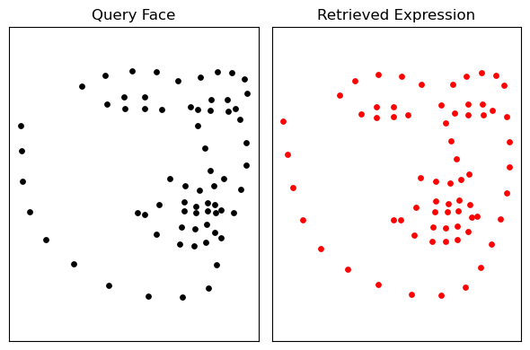

# Face Recognition Using Principal Component Analysis

Built a face recognition and similarity search system using PCA and clustering, reducing high-dimensional facial data into a compact latent representation for visualization and retrieval.

## Highlights

<table>
<tr>
<td>

- Implemented PCA from scratch using NumPy
- Reduced data dimensionality by **95%**
- Applied k-means clustering to group expressions
- Implemented similarity search in latent space

</td>

<td>

</td>

</tr>
</table>

## Technical Skills

- Python, NumPy, Matplotlib
- Principal component analysis
- Dimensionality reduction
- K-means clustering
- Query projection into latent space

## Main Content

- [`face_recognition.ipynb`](https://github.com/hengyi-liu1/face-recognition/blob/main/face_recognition.ipynb) – Project implementation

## How to Run

1. Clone the repository:
   ```bash
   git clone https://github.com/hengyi-liu1/face-recognition.git
   ```
2. Install dependencies:
   ```bash
   cd face-recognition
   pip install -r requirements.txt
   ```
3. Open `face_recognition.ipynb` in Jupyter Notebook or VS Code
4. Run all cells to reproduce results